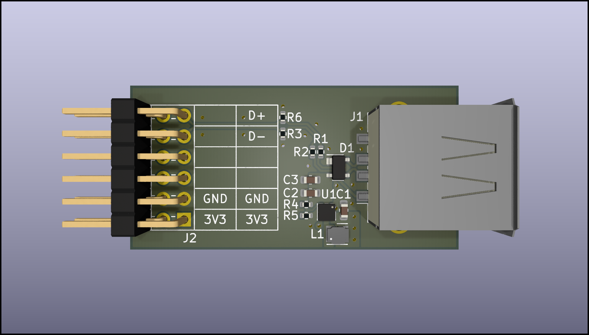

# host-usb-pmod

## Description

USB type A receptacle to Digilent Pmod™ breakout board.

- Impedance matched & length tuned differential lines
- Includes 3.3V to 5V boost converter (max. 800mA)
- Pinout to match Digilent high-speed Pmod™ e.g. on Arty A7
- Tested with Arty A7 board and USB 1.0 LS HID devices

## Contents

| File                                                 | Description             |
|------------------------------------------------------|-------------------------|
| [host-usb-pmod.pdf](./host-usb-pmod.pdf)             | Schematic in PDF format |
| [host-usb-pmod.csv](./host-usb-pmod.csv)             | BOM in CSV format       |
| [host-usb-pmod.png](./host-usb-pmod.png)             | PCB 3D render           |
|                                                      |                         |
| [host-usb-pmod.kicad_pro](./host-usb-pmod.kicad_pro) | KiCad 8.0.0 project     |
| [host-usb-pmod.kicad_pcb](./host-usb-pmod.kicad_pcb) | KiCad 8.0.0 PCB         |
| [host-usb-pmod.kicad_sch](./host-usb-pmod.kicad_sch) | KiCad 8.0.0 schematic   |

## Further Reading

- Ben Eater: How does a USB keyboard work? [^1]
- Compact USB HID host FPGA core [^2]
- A dual-socket USB host PMOD module [^3]
- Universal Serial Bus Specification 1.0 [^4]
- USB Host Dual Socket Pmod™ Compatible Module [^5]

[^1]: https://www.youtube.com/watch?v=wdgULBpRoXk
[^2]: https://github.com/nand2mario/usb_hid_host
[^3]: https://github.com/nand2mario/usb_host_pmod
[^4]: https://fabiensanglard.net/usbcheat/usb1.pdf
[^5]: https://machdyne.com/product/usb-host-dual-socket-pmod/
